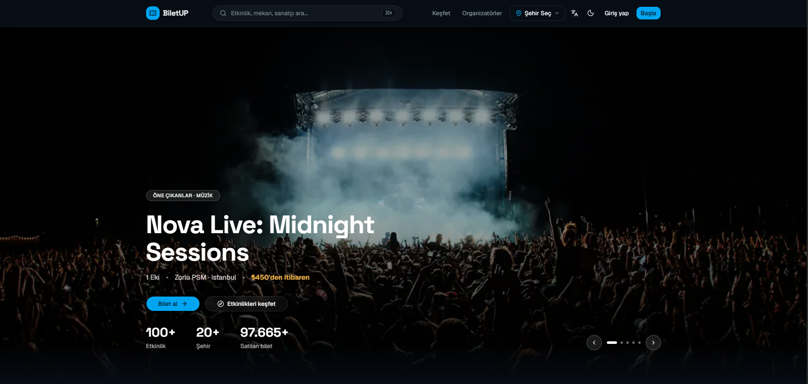
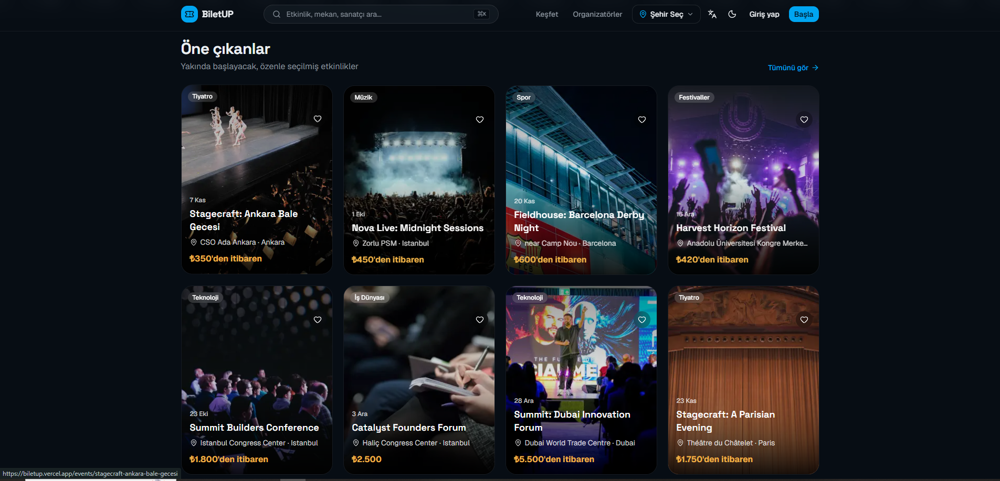
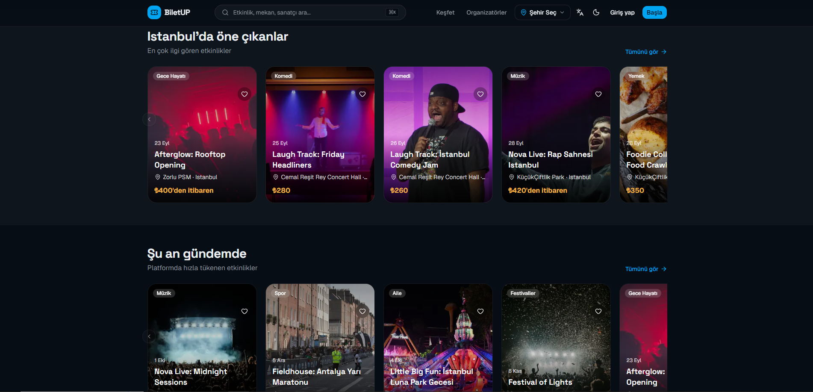
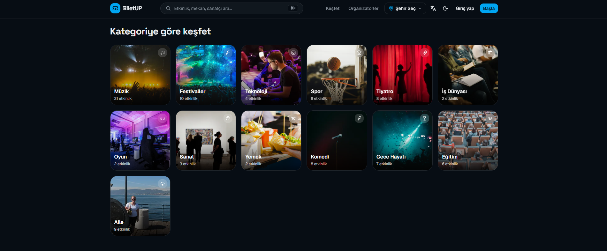
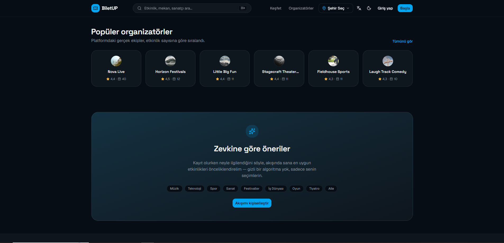
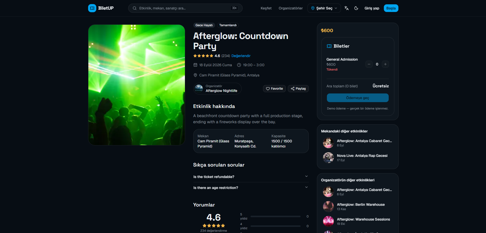
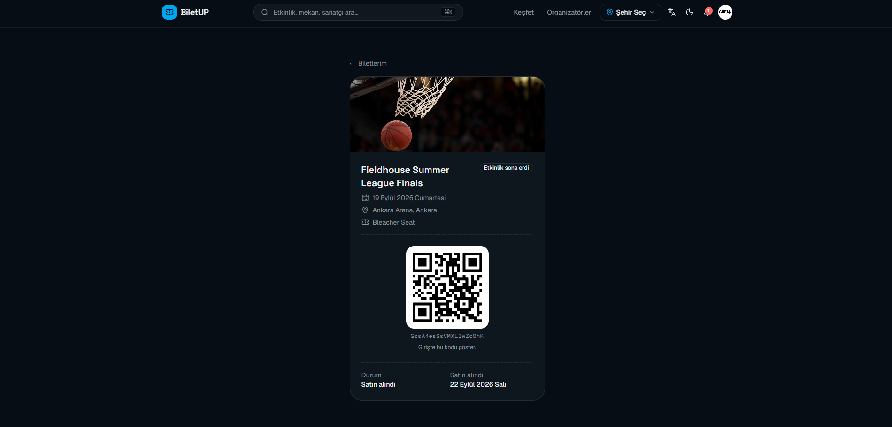

# BiletUp

Modern event discovery, ticketing and organizer management platform built with Next.js, TypeScript, Redux Toolkit, RTK Query, Firebase and Firestore.

BiletUp brings together the kind of real-world product surface a live ticketing marketplace actually needs — event discovery, ticket purchasing, organizer management, QR check-in, reviews, favorites, notifications, 8-language internationalization, and a fully responsive UI — into a single full-stack showcase project.

> This repository is the public showcase version of BiletUp. The complete production source code and private backend/administration tooling are kept in a private repository. Employers, recruiters and potential clients who need access to the complete implementation can contact me through the links below.

## Live Demo

[**biletup.vercel.app**](https://biletup.vercel.app/)

## Preview



---

## Table of contents

1. [Project overview](#1-project-overview)
2. [Product highlights](#2-product-highlights)
3. [Tech stack](#3-tech-stack)
4. [Architecture](#4-architecture)
5. [Authentication](#5-authentication)
6. [Firestore](#6-firestore)
7. [Ticketing flow](#7-ticketing-flow)
8. [Organizer flow](#8-organizer-flow)
9. [Internationalization](#9-internationalization)
10. [UI / UX](#10-ui--ux)
11. [Security](#11-security)
12. [Demo](#12-demo)
13. [Screenshots](#13-screenshots)
14. [Project structure](#14-project-structure)
15. [Local development](#15-local-development)
16. [Production / repository strategy](#16-production--repository-strategy)
17. [Roadmap / completed](#17-roadmap--completed)
18. [License](#18-license)
19. [Contact](#19-contact)

---

## 1. Project overview

BiletUp is an event discovery and ticketing platform: attendees browse events by city and category, buy demo tickets, follow organizers, favorite events, get notified, and leave reviews after attending. Organizers get their own dashboard to create and manage events, define ticket types, track attendees, and check tickets in at the door via a QR scanner.

It's built as a **portfolio-quality, product-shaped demonstration** of a modern Next.js/Firebase application — every feature listed below runs against a live Firestore backend, not local mock data, and every security boundary (who can read what, who can write what) is enforced by Firestore Security Rules on the server, not just hidden in the UI.

No real payments are processed — checkout is a real, fully-transactional Firestore write (inventory decrements, order/ticket documents, atomic rating recomputation), just without a payment processor behind it.

BiletUp is an original project by Bedirhan Elçik — design, implementation, and source code.

## 2. Product highlights

**Discovery**
- Event discovery homepage with a cinematic featured-event hero, city rails, category rails, and a past-events rail
- Full-text global search (`⌘K` / `Ctrl+K` command palette) across events, organizers, categories and cities
- Category browsing, city filtering, and a dedicated Discover page with search/date/price/sort filters
- Event detail pages with schedule, venue, FAQ, live ticket-type pricing, related events, and reviews

**Account & engagement**
- Email/password and Google authentication
- Favorites, with a live, transactionally-consistent favorite counter
- A notification center for favorite and purchase events
- Editable profile with an interest-based onboarding flow

**Ticketing**
- Ticket type selection with live stock/subtotal
- Transactional checkout (stock validation, order + ticket document creation, inventory decrement — all in one Firestore transaction)
- "My tickets" list and a ticket detail page with a QR-encoded ticket
- Reviews, gated to signed-in users who actually hold a ticket for a completed event

**Organizer platform**
- Self-serve "become an organizer" flow
- Organizer dashboard with real counts derived from the organizer's own Firestore data
- Event creation/editing, publish/unpublish, ticket type management
- Attendee list per event (search + status filter)
- Ticket check-in — manual ticket-ID entry and live camera QR scanning, both bound by the same server-enforced rule

**Platform-wide**
- 8-language localization, including right-to-left support for Arabic
- Light/dark theme
- Fully responsive layout, from small phones to desktop
- Reduced-motion-aware animation throughout

## 3. Tech stack

**Frontend**
- [Next.js 16](https://nextjs.org/) (App Router, Turbopack)
- [React 19](https://react.dev/) + TypeScript (strict mode)
- [Tailwind CSS v4](https://tailwindcss.com/)
- [shadcn/ui](https://ui.shadcn.com/) component primitives (built on [Base UI](https://base-ui.com/))
- [Framer Motion](https://www.framer.com/motion/) for interactive/component-level transitions
- [GSAP](https://gsap.com/) for landing-page/scroll sequences

**State & data**
- [Redux Toolkit](https://redux-toolkit.js.org/) for client/UI state
- [RTK Query](https://redux-toolkit.js.org/rtk-query/overview) for server-state caching, loading/error states, and cache invalidation — using a `fakeBaseQuery` so Firestore reads/writes (via the client SDK, including realtime `onSnapshot` subscriptions) get the same consistent data layer as a REST API would
- [Firebase Authentication](https://firebase.google.com/docs/auth) (Email/Password, Google)
- [Cloud Firestore](https://firebase.google.com/docs/firestore) as the primary database, accessed through the Firebase client SDK

**Forms & utilities**
- [React Hook Form](https://react-hook-form.com/) + [Zod](https://zod.dev/) for form state and validation
- [date-fns](https://date-fns.org/) + [react-day-picker](https://daypicker.dev/) for date handling/pickers
- [cmdk](https://cmdk.paco.me/) for the global search command palette
- [qrcode](https://www.npmjs.com/package/qrcode) to render each ticket's QR code, [jsqr](https://www.npmjs.com/package/jsqr) to decode camera frames for check-in
- [next-themes](https://github.com/pacocoursey/next-themes) for light/dark theme switching
- [Sonner](https://sonner.emilkowal.ski/) for toast notifications

**Tooling**
- ESLint 9 (flat config, `eslint-config-next`)
- TypeScript in strict mode across the whole codebase

> The Firebase **Admin SDK** and the credentialed scripts that use it (bulk data management, service-account-authenticated tooling) are part of the private production repository only — see [Production / repository strategy](#16-production--repository-strategy).

## 4. Architecture

```
Browser
   │
   ▼
Next.js / React (App Router, client + server components)
   │
   ▼
Redux Toolkit  ──────────────►  RTK Query (fakeBaseQuery)
   │  client/UI state only            │  server-state cache, loading/error,
   │  (auth mirror, filters,          │  invalidation — queryFn per feature
   │   ticket selection, city,        │  calls Firestore directly
   │   onboarding, ui)                │
   ▼                                  ▼
                          Firebase Client SDK
                                     │
                    ┌────────────────┴────────────────┐
                    ▼                                  ▼
          Firebase Authentication              Cloud Firestore
                    │                                  │
                    └────────────────┬─────────────────┘
                                     ▼
                       Firestore Security Rules
                 (the actual authorization boundary —
                  every read/write is checked server-side)
```

Feature domains are organized under `src/features/` (auth, events, organizer, organizers, tickets, reviews, favorites, notifications, search, profile), each owning its own RTK Query endpoints, Firestore access functions, and UI components. There is no server-side API layer of this app's own — the Next.js server renders pages and the client talks to Firestore directly through the client SDK, with **Firestore Security Rules as the only real authorization boundary** (see [Security](#11-security)).

Administrative/management tooling — the Firebase Admin-SDK scripts used to seed and reconcile production data outside the app's own UI — is intentionally **not** part of this repository. It lives in the private production repository, authenticated separately from anything a browser ever touches. See [Production / repository strategy](#16-production--repository-strategy).

## 5. Authentication

- Email/password registration and login, plus Google sign-in, via Firebase Authentication
- Auth state is mirrored into a Redux slice on `onAuthStateChanged`, so components read auth state synchronously instead of each subscribing independently
- A Firestore `users/{uid}` profile document is created on first sign-in (display name, bio, favorite categories, role)
- Protected routes (organizer dashboard, checkout, profile, tickets) wait for auth status to resolve before deciding — no flash of protected content, no bounce of a session still being restored
- **Role is never self-grantable.** `users/{uid}.role` is locked from self-edits by Firestore Security Rules; becoming an organizer happens by creating an `organizers/{uid}` document through a dedicated, self-serve flow, not by editing a field

## 6. Firestore

Firestore is the only backend. The core collections, and what each one is responsible for:

| Collection | Responsibility |
|---|---|
| `users/{uid}` | One profile per authenticated user — display name, bio, role, favorite categories |
| `organizers/{organizerId}` | Public organizer profile; `organizerId` **is** the owning user's `uid`, so ownership checks are a plain equality comparison |
| `events/{eventId}` | The core discovery document — schedule, venue, pricing, denormalized organizer info, and denormalized counters (`capacityRemaining`, `ratingAverage`, `ratingCount`, `favoriteCount`) that are only ever moved by transactions, never direct edits |
| `events/{eventId}/ticketTypes/{id}` | Ticket tiers for an event — price, total/remaining quantity, sale window |
| `orders/{orderId}` | One immutable record per checkout, with server-computed totals |
| `tickets/{ticketId}` | One document per individual ticket — the document id itself is the string encoded in its QR code; check-in flips `status: "valid" → "used"` under a tightly scoped rule |
| `reviews/{uid}_{eventId}` | One review per user per event (enforced by the composite document id itself), gated to events that have actually ended |
| `favorites/{uid}_{eventId}` / `follows/{uid}_{organizerId}` | Composite-id membership documents — existence of the doc *is* the state, avoiding an extra query on toggle |
| `notifications/{uid}/items/{id}` | Per-user notification stream, scoped by path rather than a filtered top-level collection |

**Firestore Security Rules** are the actual authorization boundary — every mechanism below is enforced server-side by Firestore itself, verified against the live project, not a client-side "the button is hidden" restriction:

- **Ownership checks** — every organizer-only write (event edits, ticket-type management, check-in) requires `request.auth.uid` to match the resource's own `organizerId`, read from the document itself, never trusted from client input
- **Buyer checks** — a ticket is only readable by the user who bought it or the organizer of its event; an order is only readable by the user who placed it
- **Counter protection** — denormalized counters (`capacityRemaining`, `favoriteCount`, `ratingAverage`/`ratingCount`, ticket-type `quantityRemaining`) can only move in the one direction a legitimate transaction would move them (e.g. `capacityRemaining` can only ever decrease, never increase, and only by itself with no other field changing in the same write) — a client can never simply set a counter to an arbitrary value
- **Protected writes** — a ticket can only be created already `"valid"` and unused (never pre-checked-in); an order can only be created already `"completed"` (never `"refunded"`); a review can only be created for an event whose `endAt` has actually passed, verified server-side against `request.time`, never the organizer-set status field

The full rules file, and the data-model rationale behind every denormalization choice, live in the private production repository alongside `docs/data-model.md`.

## 7. Ticketing flow

```
Event
  │
  ▼
Ticket type selection  (live price × quantity subtotal)
  │
  ▼
Checkout                (one Firestore transaction: validates live stock,
  │                       computes totals server-side, never trusts client price)
  ▼
Order                   (immutable once created)
  │
  ▼
Ticket(s)               (one document per unit purchased, status: "valid")
  │
  ▼
My Tickets              (list + ticket detail, QR-encoded ticket id)
  │
  ▼
Check-in                (organizer only — manual ticket-ID entry or live
                          camera QR scan, both hitting the same lookup and
                          the same server-enforced "valid" → "used" rule)
```

## 8. Organizer flow

```
Organizer login
  │
  ▼
Become an organizer     (self-serve — creates organizers/{uid})
  │
  ▼
Dashboard                (real counts: events, tickets sold, capacity/attendance,
  │                        computed from the organizer's own Firestore data)
  ▼
Create / edit event      (draft → publish, schedule, venue, FAQ)
  │
  ▼
Ticket types              (create / edit / delete — capacity can be resized but
  │                         never shrunk below what's already sold)
  ▼
Attendees                (per-event list, search + status filter)
  │
  ▼
Check-in                 (manual ticket-ID entry or camera QR scan)
```

## 9. Internationalization

BiletUp ships with a full, type-checked 8-language localization system:

Turkish · English · German · Arabic · French · Spanish · Portuguese · Italian

- Every user-facing dictionary is a single TypeScript object per language, checked with `satisfies Dictionary` against the base (English) dictionary's shape — a missing translation key in any language fails the build instead of silently falling back at runtime
- Locale switches instantly on the current page — no route reload, no `[locale]` URL segment
- **Arabic renders fully right-to-left**: `<html dir>` is set from the active locale, and the whole UI is built with logical Tailwind classes (`ps-`/`pe-`/`text-start`/`text-end`, not `pl-`/`pr-`/`text-left`/`text-right`), so layout genuinely mirrors instead of just flipping text alignment
- Dates and prices are formatted per-locale via `Intl`, not string concatenation

## 10. UI / UX

- Fully responsive, from small phones up through desktop, using Tailwind's mobile-first breakpoints throughout
- Light and dark themes (`next-themes`, class-based), with every color defined as a design token so components never hardcode a shade
- `prefers-reduced-motion` is respected everywhere animation appears — the hero carousel, count-up stats, and section entrances all degrade to a static state rather than ignoring the setting
- A cinematic, image-led homepage hero (real event photography, not stock/marketing images), horizontally-scrolling event rails by city/category, and an image-first event card design
- A `⌘K`/`Ctrl+K` global search palette with debounced search, loading/empty states, and full keyboard navigation
- Accessible by construction where it matters most: labeled icon-only buttons, `aria-live` regions for async state changes, keyboard-operable carousel controls, and semantic heading structure

## 11. Security

- **Firebase's client config (`NEXT_PUBLIC_FIREBASE_*`) is not a secret.** It's a public identifier embedded in every client bundle by design — the actual access boundary is Firestore Security Rules, not hiding these values. See `.env.example` for the exact variables this app needs.
- **Firestore Security Rules are the real authorization layer** — every ownership check, buyer check, and counter-protection rule described in [Firestore](#6-firestore) runs server-side inside Firestore itself, independent of anything the client sends.
- **Admin/management tooling is private.** Any script or process that authenticates with elevated (Admin SDK / service-account) credentials is excluded from this repository entirely and lives only in the private production repository, run manually and locally — never as part of the deployed application.
- **No credential or service-account file is ever committed**, in this repository or the production one — `.env.local` and any credential file are git-ignored, and only `.env.example` (placeholders, no values) is tracked.
- **This repository is a curated subset**, not the full production source — see [Production / repository strategy](#16-production--repository-strategy) for exactly what that means.

## 12. Demo

**Live demo:** [biletup.vercel.app](https://biletup.vercel.app/)

## 13. Screenshots

The homepage is shown at the top of this README, under [Preview](#preview). The rest of the homepage, plus event detail and ticketing:

**Featured & trending events**


**City rails & trending now**


**Browse by category**


**Popular organizers & personalized recommendations**


**Event detail**


**Ticket detail & QR check-in**


## 14. Project structure

Reflects this repository's actual layout — a curated subset of the production application (see [section 16](#16-production--repository-strategy) for what's excluded):

```
src/
  app/                  Next.js App Router routes
    events/[slug]/          event detail
    organizers/, organizers/[name]/   organizer directory + profile
    organizer/               organizer dashboard, event management
    checkout/, tickets/, tickets/[ticketId]/
    discover/, login/, register/, onboarding/, profile/
  components/
    ui/                   shadcn/ui primitives
    layout/                Header, Footer, ThemeProvider/Toggle, CitySelector, LanguageSelector
    home/                  homepage sections (Hero, EventRail, CategoryGrid, CityMarquee, ...)
    shared/                reusable app-level components (CoverImage, ImageUploadField, ...)
  features/               feature-oriented modules
    auth/  events/  organizer/  organizers/  tickets/  reviews/  favorites/  notifications/  search/  profile/
  redux/
    store.ts               configureStore, one instance per request
    slices/                 auth, ui, filters, ticketSelection, onboarding, city
    api/                    RTK Query base apiSlice (fakeBaseQuery) + per-feature injected endpoints
  lib/
    firebase/               client.ts, config.ts, and one module per domain (events, orders, tickets,
                             reviews, favorites, notifications, organizers, organizerEvents, ticketTypes,
                             users, storage)
    i18n/                   LocaleProvider, locale metadata, 8 dictionaries
    mock/                   static reference data (category taxonomy)
  types/                   shared TypeScript types
docs/
  screenshots/             desktop/mobile captures for this README
```

## 15. Local development

**This public repository contains a selected showcase subset of the production application.** It is meant to be read, not cloned-and-run as a complete product — the private administration tooling, production seed dataset, and some backend implementation detail that a full local run would need are intentionally kept in the private production repository (see the next section).

If a `package.json` and the app's own source are included in this pass of the repository, the standard flow still applies for exploring it locally:

```bash
npm install
cp .env.example .env.local   # fill in your own Firebase project's public web config
npm run dev
```

Without a configured Firebase project, the app still renders — authentication and Firestore-backed features simply show their "not configured" state rather than crashing.

## 16. Production / repository strategy

BiletUp is intentionally split across two repositories:

```
Private GitHub Repository
   │  full application source, Firebase integration, Firestore logic,
   │  auth, tickets/orders/favorites/notifications/reviews, organizer
   │  system, Firestore Security Rules, i18n, admin/seed tooling
   ▼
Vercel  →  https://biletup.vercel.app/
```

```
Public GitHub Repository  (this one)
   │  selected frontend/UI source, architecture documentation,
   │  screenshots, sanitized configuration examples
   ▼
Public showcase of BiletUp — read, not deployed
```

The production repository's full source is not published here. What you're reading is a deliberately curated subset intended to demonstrate real architecture and code quality — not a stripped-down or unfinished project. If you need the complete implementation (for an evaluation, a technical interview, or a commercial engagement), see [Contact](#19-contact).

## 17. Roadmap / completed

**Completed and running against live Firebase (not mock data):**
- Authentication (email/password + Google), protected routes, profile + interest onboarding
- Event discovery, search, filtering, sorting, event detail
- Favorites, notifications
- Transactional ticket checkout, "My tickets", QR-encoded tickets
- Full organizer platform: dashboard, event CRUD, ticket-type management, attendee list
- Ticket check-in — manual entry and live camera QR scanning
- Reviews, gated to ticket-holders of completed events, with atomic rating recomputation
- Global `⌘K` search
- 8-language localization with full Arabic RTL support
- Light/dark theme, responsive layout across breakpoints

**Not yet included:**
- Server-triggered notifications (e.g. "an organizer you follow published a new event") — this needs a trusted backend (Cloud Functions), which this project doesn't currently use
- Exclusive/unlockable event content for ticket-holders

## 18. License

Copyright © Bedirhan Elçik. All rights reserved.

This repository is published for demonstration and showcase purposes. Copying, modifying, distributing, republishing, using the source commercially, or using it as the basis for a derivative project requires prior written permission from the copyright holder.

You're welcome to read the code and review the architecture. See the full text in [`LICENSE.public`](LICENSE.public), and reach out below for licensing questions or access to the full production implementation.

## 19. Contact

- LinkedIn: [linkedin.com/in/bedirhanelcik](https://www.linkedin.com/in/bedirhanelcik/)
- GitHub: [github.com/BedirhanElcik](https://github.com/BedirhanElcik)
- Email: [bedrhanelck@outlook.com](mailto:bedrhanelck@outlook.com)
- Portfolio: Coming soon
